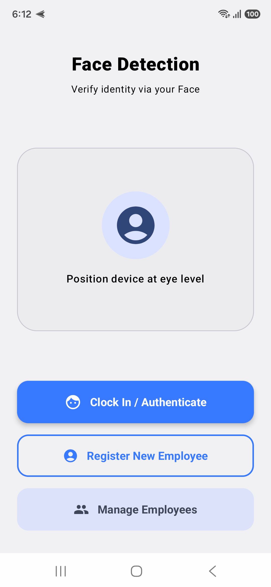
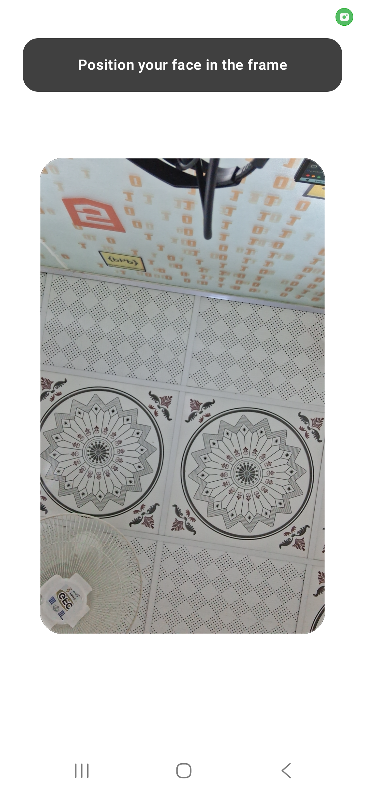
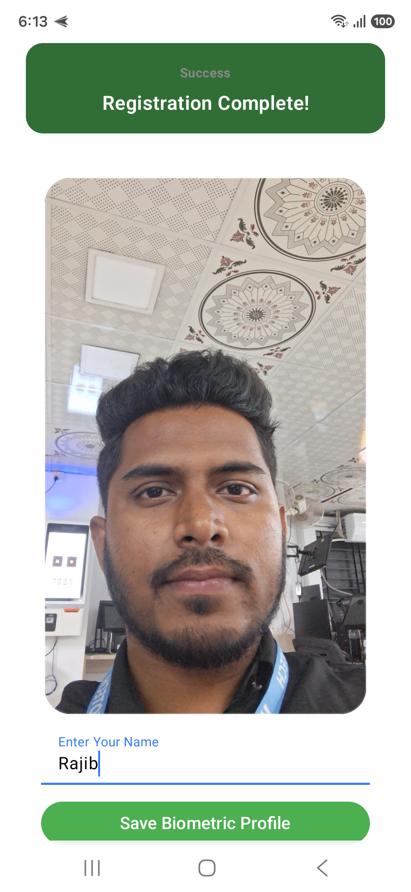
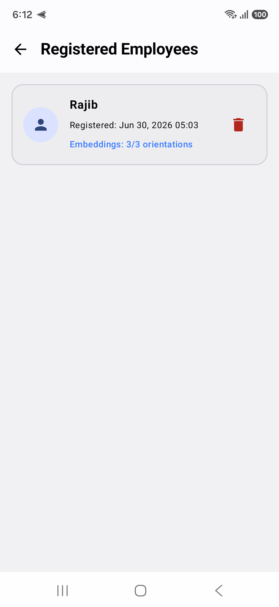
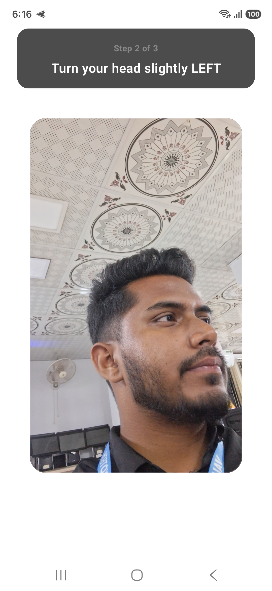

# 🚀 Advanced Face Detection & Recognition App

A high-performance, real-time Android face recognition application utilizing **TensorFlow Lite (MobileFaceNet)** and **Google ML Kit Face Detection**. This project is engineered for maximum accuracy, low-latency processing, and robust database vector matching.

---

## 📱 Visual Showcase & Interface

Here is a look at the application in action. Place your extracted screenshots in a directory named `screenshots/` at the root of your repository to display them seamlessly below.

|:-----------------------------------------------------------------------:|:---------------------------------------------------------------------:|:-------------------------------------------------------------------------:|
|  |  |  |
|  |  |  |

---

## ✨ Key Features & Technical Architecture

- **⚡ Real-time Inference Pipeline:** Seamless integration of Google ML Kit for lighting-fast face bounding-box detection, feeding directly into MobileFaceNet for 192-dimensional vector embedding extraction.
- **🎯 Maximum Accuracy Enhancements:**
  - **L2 Vector Normalization:** In-place mathematical L2 normalization optimized for unit vectors, reducing garbage collection overhead and boosting matching reliability.
  - **Multi-Pose Enrolment:** Stores separate unique vectors per profile (e.g., Front, Left, Right) instead of feature-diluting averaging techniques.
- **🚀 Hardware Accelerated Execution:** Automated fallback mechanism leveraging the **TFLite GPU Delegate** on supported devices, gracefully scaling down to dynamic CPU multi-threading if unavailable.
- **💾 Embedded Vector DB:** Local storage tracking explicit multi-pose embeddings mapped directly back to target relational data identities.

---

## 🛠️ Deep Dive: Highly Optimized Encoder

The performance core utilizes an optimized **MobileFaceNet** configuration to handle input tensors efficiently:

```kotlin
// Snippet highlighting the ultra-fast L2 Normalization & Hardware Allocation
val options = Interpreter.Options().apply {
    val compatList = CompatibilityList()
    if (compatList.isDelegateSupportedOnThisDevice) {
        gpuDelegate = GpuDelegate(compatList.bestOptionsForThisDevice)
        addDelegate(gpuDelegate)
    } else {
        setNumThreads(Runtime.getRuntime().availableProcessors().coerceAtMost(4))
    }
}
```


## 🤝 Contributing
Contributions, issue reports, and feature requests are welcome! Feel free to check out the issues page if you want to help optimize the vector matching pipeline further.
